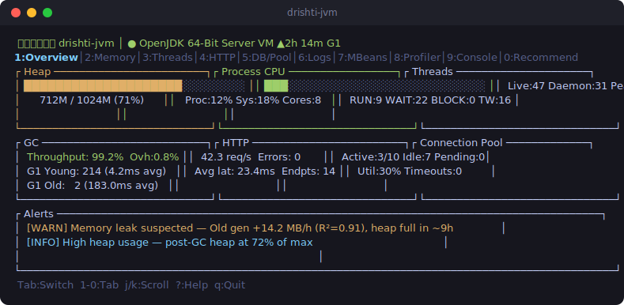
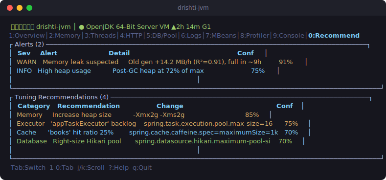
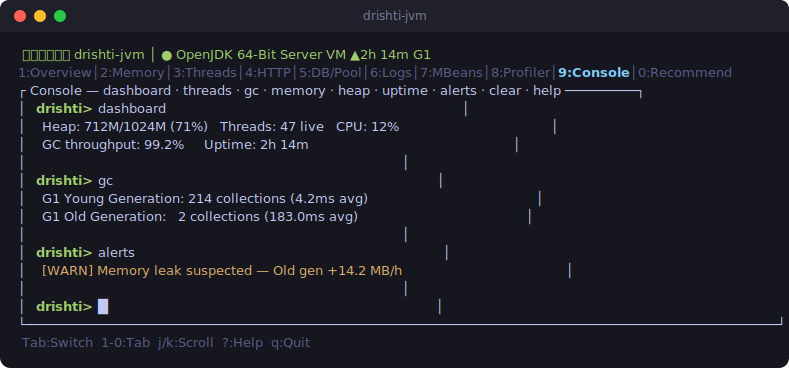

# दृष्टि — drishti-jvm

[](https://github.com/piyooshsinha/drishti-jvm/actions/workflows/ci.yml)
[](LICENSE)


> A Rust + Ratatui TUI that monitors memory, scale, bugs, and performance of Spring Boot / JVM applications — and recommends JVM tuning.



## Quick Start

```bash
# 1. Setup dev environment
./scripts/setup-env.sh

# 2. Launch the lab Spring Boot app
cd docker && docker compose up -d

# 3. Verify data sources & generate test fixtures
cd .. && ./scripts/verify-sources.sh

# 4. Build and run
cargo build --workspace
cargo run -p drishti-tui -- \
  --actuator http://localhost:8080/actuator \
  --jolokia http://localhost:8778/jolokia
```

## Screens

10 tabs: Overview, Memory, Threads, HTTP, DB/Pool, Logs, MBeans, Profiler, Console, Recommend.

**Recommend** — anomaly alerts (memory leak regression, GC pressure, deadlocks, pool exhaustion, high heap) paired with copy-pasteable JVM tuning flags:



**Console** — Arthas-style REPL with command history:



*(Illustrative renders of the TUI layout — run it against the Docker lab below for the real thing.)*

## Headless mode (scripting / CI)

```bash
drishti-jvm --once --json               # one JvmSnapshot as pretty JSON
drishti-jvm --once --recommendations    # anomaly alerts + tuning flags as text
drishti-jvm --once                      # compact human-readable summary
```

Exit code is non-zero if no data source is reachable, so it doubles as a health probe.

## Configuration

All URLs, polling intervals, and alert thresholds are configurable. Load order
(later overrides earlier): compiled defaults → `/etc/drishti-jvm/config.toml` →
`~/.config/drishti-jvm/config.toml` → `./drishti-jvm.toml` → `DRISHTI_*` env vars →
CLI flags. See [config/default.toml](config/default.toml) for every knob.

## Keybindings

Tab/Shift+Tab: cycle tabs | 1-9, 0: jump to tab | j/k: scroll | ?: help | q: quit

## Workspace — 5 crates, ~7,500 lines

- **drishti-core** — Data model (12 struct families), TimeSeries ring buffer with linear regression, 5 anomaly detectors, 5 tuning rules, SQLite persistence (`--features persistence`), multi-JVM target manager
- **drishti-jolokia** — Jolokia HTTP client with bulk request builder, response parsing, JvmSnapshot converter
- **drishti-actuator** — Spring Boot Actuator client with Prometheus parser, metric-name normalization across Boot 2.x/3.x, health (Boot 2+3), thread dumps, remote log tailing via HTTP Range
- **drishti-gclog** — GC log parsers (G1, ZGC classic + generational, Shenandoah), unified log prefix, algorithm auto-detection, async file tailer
- **drishti-tui** — Ratatui app with 10 tabs (Overview, Memory, Threads, HTTP, DB/Pool, Logs, MBeans, Profiler, Console, Recommendations), async-profiler integration, Arthas-style console REPL

See [PLAN.md](PLAN.md) for the full roadmap and remaining work.

## License

MIT
